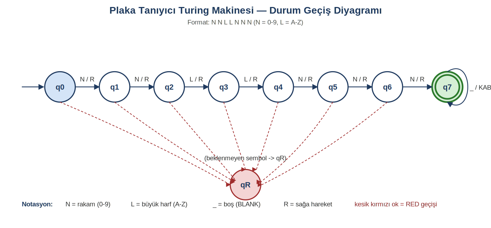
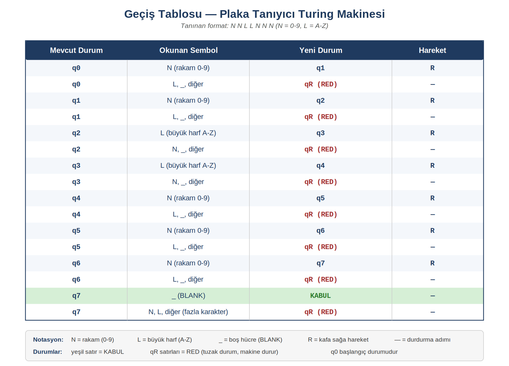
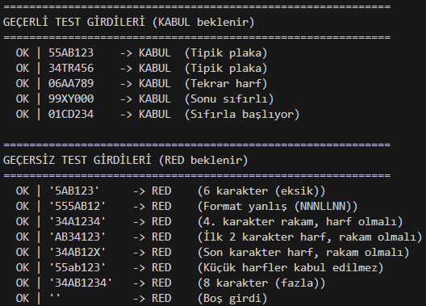

# Turing Makinesi ile Araç Plaka Formatı Tanıyıcı

Tek bantlı deterministik bir **Turing Makinesi (TM)** simülatörü. Verilen bir karakter dizisinin önceden tanımlı plaka formatına uyup uymadığını, durum geçişleri üzerinden adım adım karar verir.

Ders: *Özdevinirler Kuramı (Otomata Teorisi) — Final Ödev 2*

---

## Tanınan Dil

```
L = { w | w = N N L L N N N,  N ∈ {0..9},  L ∈ {A..Z} }
```

Yani kabul edilen her dize **tam 7 karakter** uzunluğundadır ve şu yapıyı taşır:

| Pozisyon | 1 | 2 | 3 | 4 | 5 | 6 | 7 |
|----------|---|---|---|---|---|---|---|
| Beklenen | N | N | L | L | N | N | N |

Küçük harfler, özel karakterler veya 7'den farklı uzunluktaki girdiler diline ait değildir ve **reddedilir.**

## Makine Tanımı

`M = (Q, Σ, Γ, δ, q0, B, F)` yedilisi:

- `Q = { q0, q1, q2, q3, q4, q5, q6, q7, qR }`
- `Σ = { 0..9, A..Z }`
- `Γ = Σ ∪ { _ }` (bant alfabesi, `_` = BLANK)
- `q0` — başlangıç durumu
- `F = { q7 }` — kabul durumu (BLANK okunduğunda)
- `qR` — red (tuzak) durumu

Her durum yalnızca beklediği karakter sınıfını kabul eder; aksi halde doğrudan `qR`'ye düşer. Kafa her geçişte sağa hareket eder. Uzunluk kontrolü ayrı bir koşul olarak değil, geçişlerin doğal sonucu olarak yapılır: 7'den kısa girdi `q7`'ye varmadan BLANK okur, 7'den uzun girdi `q7`'de fazladan sembol görür ve her iki durum da red ile sonuçlanır.

## Durum Geçiş Diyagramı



## Geçiş Tablosu



## Çalıştırma

Bağımlılık yok, sadece Python 3.7+ gerekir.

```bash
python tm_plaka.py
```

Program plakayı sorar, her geçişi adım adım yazdırır ve sonunda `KABUL` veya `RED` döndürür.

## Örnek Çalıştırma



## Test Sonuçları

| Tip | Adet | Sonuç |
|-----|------|-------|
| Geçerli girdiler (KABUL beklenen) | 5 | 5/5 doğru |
| Geçersiz girdiler (RED beklenen) | 8 | 8/8 doğru |
| **Toplam** | **13** | **13/13** |

Test edilen senaryolar: tipik plaka, sıfırla başlayan plaka, tekrarlı harf, eksik karakter (6), fazla karakter (8), küçük harf, yanlış pozisyonda karakter sınıfı, boş girdi.

## Dosyalar

- [tm_plaka.py](tm_plaka.py) — Turing makinesi simülatörü kaynak kodu
- [durum_diyagrami.png](durum_diyagrami.png) — durum geçiş diyagramı
- [gecis_tablosu.png](gecis_tablosu.png) — δ geçiş tablosu
- [örnekler.png](örnekler.png) — örnek çalıştırma ekran görüntüleri
